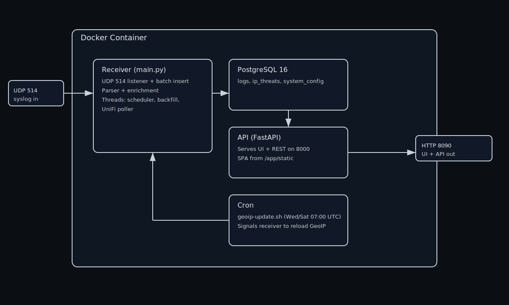

# 🔍 UniFi Log Insight


Real-time log analysis for UniFi routers and gateways - captures syslog over UDP, parses firewall, DHCP, Wi-Fi, and system events, enriches them with GeoIP, ASN, threat intelligence, and reverse DNS, then serves everything through a live Dashboard.

Single Docker container. No external dependencies. Zero data collection.

## 📚 Table of Contents

- [✨ Features](#-features)
- [📋 Prerequisites](#-prerequisites)
- [🚀 Quick Start](#-quick-start)
- [🏗️ Architecture](#️-architecture)
- [⚙️ Configuration Reference](#️-configuration-reference)
- [🗺️ MaxMind Auto-Update](#️-maxmind-auto-update)
- [🛡️ AbuseIPDB Integration](#️-abuseipdb-integration)
- [🖥️ UI Guide](#️-ui-guide)
- [🤖 AI Agent Integration (MCP)](#-ai-agent-integration-mcp)
- [📡 API Endpoints](#-api-endpoints)
- [🔤 DNS Logging](#-dns-logging)
- [🖧 Unraid Setup](#-unraid-setup)
- [🧹 Database Maintenance](#-database-maintenance)
- [🔧 Troubleshooting](#-troubleshooting)
- [⚖️ Disclaimer](#-disclaimer)
- [📄 License](#-license-1)
- [🖥️ App Screenshots](#app-screenshots)

## ✨ Features

- **Live Log Stream** - Auto-refreshing table with expandable details, copy-to-clipboard, and intelligent pause/resume
- **AI Agent Integration (Beta)** - Connect Claude Desktop, Claude Code, or Gemini CLI via the [Model Context Protocol (MCP)](#-ai-agent-integration-mcp) to query your network data through natural conversation
- **Threat Map** - Interactive world map showing where threats and blocked outbound traffic originate. Switch between heatmap and cluster views, filter by time range, and click any point to inspect individual logs in a sidebar
- **Dashboard** - Traffic breakdowns, top blocked/allowed countries and IPs, top threats with ASN/city/rDNS/categories, top devices, services, DNS queries
- **Filters** - Log type, time range, action, direction, VPN badge, interface, service, country, ASN, threat score, IP, rule name, text search
- **IP Enrichment** - GeoIP (country, city, coordinates), ASN, reverse DNS via MaxMind GeoLite2 with scheduled auto-update and hot-reload
- **AbuseIPDB Integration** - Threat scoring (23 categories, Tor detection, usage type), daily blacklist pre-seeding, automatic backfill
- **Syslog Receiver** - UDP 514 listener parsing firewall, DHCP, Wi-Fi, DNS, and system events
- **Multi-WAN & Direction** - Per-interface WAN IP mapping for failover/load-balanced setups. Auto-classifies traffic as inbound, outbound, inter-VLAN, local, or VPN
- **VPN Detection** - Auto-detects VPN interfaces (WireGuard, OpenVPN, Teleport, Site Magic) with badge assignment, labels, and CIDRs
- **UniFi Integration** - Network discovery, device name resolution, and firewall syslog management via **UniFi OS** (API key) or **self-hosted controllers** (username/password)
- **Firewall Syslog Manager** - Zone matrix with bulk toggle - enable syslog on firewall rules without leaving the app (UniFi OS)
- **Device Names** - Friendly names from UniFi clients/devices with historical backfill
- **Theming & Preferences** - Dark/light theme, country display format, IP subline (show ASN beneath IPs)
- **Interface Labels** - Color-coded labels for traffic flow, applied retroactively to all logs
- **CSV Export** - Download filtered results up to 100K rows
- **Retention** - Configurable per log type (60-day default, 10-day DNS). Adjustable via Settings or env vars
- **Backup & Restore** - Export/import all settings as JSON
- **DNS Ready** - Full DNS query parsing ([requires configuration](#-dns-logging))
- **Mobile Responsive** - Collapsible filters, full-width table on small screens
- **Setup Wizard** - Two paths: **UniFi API** (auto-detects WAN, VLANs, topology) or **Log Detection** (discovers interfaces from live traffic)

---

> **Need help fast?** Jump to [Troubleshooting](#-troubleshooting).

## 📋 Prerequisites

- **Docker** and **Docker Compose**
- **UniFi Router** (or any UniFi gateway that supports remote syslog)
- **MaxMind GeoLite2 account** ([free signup](https://www.maxmind.com/en/geolite2/signup)) - for GeoIP/ASN lookups
- **AbuseIPDB API key** ([free tier](https://www.abuseipdb.com/register?plan=free), optional) - for threat scoring

**Minimum host resources (estimated):**

- **CPU:** 2 cores/threads minimum (PostgreSQL + receiver + API run concurrently)
- **Disk:** 10 GB free for the database volume (`pgdata`) at minimum

These are baseline estimates for a small home network. Higher log volume or longer retention will require more disk. If you run with tight disk limits, see **Database Maintenance** below.

---
## 🚀 Quick Start

> 🖧 **Running Unraid?** Skip to the [Unraid Setup](#-unraid-setup) section for a no-terminal install guide.

## 1. Configure Your UniFi Router

### 1.1 Enable Syslog on the Router

In your UniFi Network controller:

1. Go to **Settings → CyberSecure → Traffic Logging**
2. Enable **Activity Logging (Syslog)**
3. Under Contents, select Clients, Critical, Devices, Security Detections, Triggers, VPN, Firewall Default Policy
4. Set the syslog server to `<docker-host-ip>` on port `514`
5. Click Apply Changes

### 1.2 Enable Syslog Per Firewall Rule

Each firewall rule must have syslog individually enabled. There are two ways to do this:

**Option A - Use UniFi Log Insight (recommended):** Connect via the UniFi API during setup (or later in Settings), then use the built-in **Firewall Syslog Manager** to view all your zone policies and bulk-toggle syslog - no need to touch the UniFi controller UI.

**Option B - Manually in the UniFi controller:** Go to **Settings → Policy Engines → Zones**, select each rule, and enable the **Syslog** toggle.

> **Note:** Without per-rule syslog enabled, firewall logs will not appear even if global Activity Logging is configured.


## 2. Install

### Option A - Pull Pre-built Image (recommended)

**Recommended setup:** Use a single `docker-compose.yml` and put your environment variables directly inside it.  
If you add real credentials here, do not commit the file to a public repo.

**Files you need**

- **Required:** `docker-compose.yml`
- **Optional:** `.env` (only if you want a separate env file)

**`docker-compose.yml` (recommended — single file)**

```yaml
services:
  unifi-log-insight:
    image: ghcr.io/jmasarweh/unifi-log-insight:latest
    container_name: unifi-log-insight
    restart: unless-stopped
    ports:
      - "514:514/udp"
      - "8090:8000"
    volumes:
      - pgdata:/var/lib/postgresql/data
      - ./maxmind:/app/maxmind
    environment:
      POSTGRES_PASSWORD: "your_strong_password_here"
      ABUSEIPDB_API_KEY: "your_key_here"
      MAXMIND_ACCOUNT_ID: "your_account_id"
      MAXMIND_LICENSE_KEY: "your_license_key"
      LOG_LEVEL: "INFO"
      TZ: "Europe/London"
      UNIFI_API_KEY: "your_unifi_api_key_here"
      UNIFI_HOST: "https://192.168.1.1"
    healthcheck:
      test: ["CMD", "pg_isready", "-U", "unifi", "-d", "unifi_logs"]
      interval: 15s
      timeout: 5s
      retries: 5

volumes:
  pgdata:
    name: unifi-log-insight-pgdata
```

**Optional: `.env`** (only if you want a separate env file instead of `environment:`)

```env
# PostgreSQL (required)
POSTGRES_PASSWORD=your_strong_password_here

# MaxMind GeoLite2 - free at https://www.maxmind.com/en/geolite2/signup
# Auto-downloads .mmdb files on first boot if not already present
MAXMIND_ACCOUNT_ID=your_account_id
MAXMIND_LICENSE_KEY=your_license_key

# AbuseIPDB - free at https://www.abuseipdb.com/register (optional)
ABUSEIPDB_API_KEY=your_key_here

# Timezone (for cron schedules). See https://gist.github.com/Soheab/3bec6dd6c1e90962ef46b8545823820d
TZ=Europe/London

# UniFi API (optional - can also be configured via Settings UI)
# UNIFI_HOST=https://192.168.1.1
# UNIFI_API_KEY=your_unifi_api_key_here
```

If you use `.env`, remove the `environment:` block above and add:

```yaml
    env_file:
      - .env
```

Then run:

```bash
docker compose up -d
```

### Option B - Build from Source

```bash
git clone https://github.com/jmasarweh/unifi-log-insight.git
cd unifi-log-insight
# Create .env as shown above
docker compose up -d --build
```

## 3. Open the UI

Navigate to `http://<docker-host-ip>:8090`

On first launch, a **Setup Wizard** will guide you through configuration. You can choose between two paths:

#### Path A - UniFi API (recommended)

Connect to your UniFi Controller to auto-detect everything:

1. **Connect** - Choose your controller type:
   - **UniFi OS** (cloud key, UDM, UDR) - Enter your controller IP and API key (Local Admin)
   - **Self-hosted controller** - Enter your controller IP, username, and password

   If your controller uses a self-signed or custom SSL certificate, enable **Skip SSL verification** under Advanced before testing.
2. **WAN Detection** - WAN interfaces are auto-detected from the controller's network config.
3. **Network Labels** - VLANs and subnets are pre-populated from the controller. Just review and label.
4. **Firewall Rules** - View your zone matrix and enable syslog on firewall rules directly from the wizard (UniFi OS only).

#### Path B - Log Detection

If you don't want to connect the API, the wizard falls back to log-based discovery:

1. **WAN Detection** - Select your WAN interface(s) from interfaces seen in traffic. Common interfaces:

   | UniFi Model | Typical WAN Interface |
   |---|---|
   | UDR (PPPoE) | `ppp0` |
   | UDR (DHCP) | `eth3` |
   | UDM / UDM-SE | `eth8` |
   | USG | `eth0` |
   | UDM-Pro | `eth8` or `eth9` |

2. **Network Labels** - Give each interface a friendly name (e.g., "IoT" instead of "br20").
3. **Summary** - Review and save.

You can reconfigure at any time via the **Settings gear** in the top-right corner of the UI.

---

## 🏗️ Architecture

Everything runs inside a single Docker container, managed by supervisord:



### Current architecture:

- PostgreSQL 16 process for `logs`, `ip_threats`, and config state.
- Receiver process (`main.py`) listens on UDP `514`, parses logs, enriches (GeoIP, ASN, AbuseIPDB, rDNS, UniFi device names), and batch-inserts into Postgres. It also runs background threads for stats + WAN/gateway detection, retention cleanup, AbuseIPDB blacklist pulls, threat backfill, and UniFi client/device polling.
- API process (`api.py`) serves REST endpoints and the React SPA from `/app/static` on port `8000` (mapped to `8090` by docker-compose).
- Cron process runs `geoip-update.sh` (Wed/Sat 07:00 UTC when MaxMind credentials are set), which refreshes GeoIP databases and signals the receiver to reload them.

### 🔀 Log Processing Pipeline

1. **Receive** - Raw syslog UDP packets from Unifi
2. **Parse** - Extract fields from iptables, hostapd, dhclient, and dnsmasq messages (when DNS logging is enabled)
3. **Validate** - IP address validation rejects malformed data before DB insert
4. **Classify** - Determine direction (inbound/outbound/inter-VLAN/local/VPN) based on interfaces and WAN IP
5. **Enrich** - GeoIP country/city/coords, ASN org name, AbuseIPDB threat score + categories + detail fields (verbose mode), reverse DNS
6. **Store** - Batched inserts into PostgreSQL with row-by-row fallback on failure
7. **Serve** - REST API with pagination, filtering, sorting, and CSV export

---

## ⚙️ Configuration Reference

### Environment Variables

| Variable | Description |
|---|---|
| `POSTGRES_PASSWORD` | PostgreSQL password for the `unifi` user |
| `ABUSEIPDB_API_KEY` | Enables threat scoring on blocked inbound IPs. Free tier: 1,000 check lookups/day + 5 blacklist pulls/day |
| `MAXMIND_ACCOUNT_ID` | Enables GeoIP auto-update. Without it, manually place `.mmdb` files |
| `MAXMIND_LICENSE_KEY` | Paired with account ID for auto-update |
| `TZ` | Timezone for cron schedules. Defaults to UTC. Examples: `Europe/London`, `Asia/Amman`, `America/New_York`. [See supported timezones](https://gist.github.com/Soheab/3bec6dd6c1e90962ef46b8545823820d) |
| `LOG_LEVEL` | Logging verbosity: `DEBUG`, `INFO`, `WARNING`, `ERROR`, `CRITICAL`. Defaults to `INFO`. Set to `WARNING` for quiet steady-state. Use `DEBUG` for troubleshooting |
| `UNIFI_HOST` | *(optional)* UniFi Controller URL (e.g., `https://192.168.1.1`). Can also be set via the Settings UI |
| `UNIFI_API_KEY` | *(optional)* UniFi API key (Local Admin, for UniFi OS). Can also be set via the Settings UI where it's stored encrypted |
| `UNIFI_SITE` | *(optional)* UniFi site name. Defaults to `default` |
| `UNIFI_VERIFY_SSL` | *(optional)* Set to `false` for self-signed certificates. Defaults to `true` |
| `UNIFI_POLL_INTERVAL` | *(optional)* Device polling interval in seconds. Defaults to `300` (5 minutes) |
| `RETENTION_DAYS` | *(optional)* Log retention in days for firewall/DHCP/Wi-Fi/system. Defaults to `60`. Can also be set via Settings UI |
| `DNS_RETENTION_DAYS` | *(optional)* DNS log retention in days. Defaults to `10`. Can also be set via Settings UI |

### Ports

| Port | Protocol | Purpose |
|---|---|---|
| 514 | UDP | Syslog receiver (incoming logs from Unifi) |
| 8090 | TCP | Web UI and REST API |

### Retention Policy

| Log Type | Default | Range |
|---|---|---|
| Firewall, DHCP, Wi-Fi, System | 60 days | 60–365 days |
| DNS (when enabled) | 10 days | 1–365 days |

Retention is configurable via the **Settings > Data & Backups** slider, or via `RETENTION_DAYS` / `DNS_RETENTION_DAYS` environment variables. Cleanup runs daily at 03:00 (container local time).

---

## 🗺️ MaxMind Auto-Update

When credentials are configured, GeoLite2 databases update automatically on **Wednesday and Saturday at 7:00 AM** (local time per `TZ` - [supported timezones](https://gist.github.com/Soheab/3bec6dd6c1e90962ef46b8545823820d)). This aligns with MaxMind's Tuesday/Friday publish schedule, giving a buffer for propagation.

The receiver hot-reloads databases via signal - no container restart required.

### Manual Update

```bash
docker exec unifi-log-insight /app/geoip-update.sh
```

### Check Update Logs

```bash
docker exec unifi-log-insight cat /var/log/geoip-update.log
```

---

## 🛡️ AbuseIPDB Integration

When `ABUSEIPDB_API_KEY` is configured, the system provides multi-layered threat intelligence:

### Threat Scoring

Blocked firewall events trigger a lookup against AbuseIPDB using verbose mode, returning:
- **Confidence score** (0–100%) with severity classification (Clean/Low/Medium/High/Critical)
- **Attack categories** - Decoded from 23 category codes (Port Scan, SSH, Brute-Force, DDoS, etc.)
- **Usage type** - Data Center, Residential, VPN, etc.
- **Tor exit node** detection
- **Whitelist** status
- **Report count** and last reported date

### Three-Tier Cache

To minimise API usage, lookups follow a cache hierarchy:

1. **In-memory cache** - Hot path, zero I/O
2. **PostgreSQL `ip_threats` table** - Persistent across container rebuilds, 4-day TTL
3. **AbuseIPDB API** - Only called on cache miss, results written back to both tiers

### Blacklist Pre-seeding

A daily pull of the AbuseIPDB blacklist (10,000 highest-risk IPs at 100% confidence) is bulk-inserted into the threat cache. Any blocked IP matching the blacklist gets an instant score from cache - no API call consumed. Uses a separate quota (5 calls/day) independent of the check individual IP quota.

The blacklist runs on startup (30-second delay) and then daily at 04:00.

### Rate Limiting

The system uses AbuseIPDB response headers (`X-RateLimit-Remaining`, `Retry-After`) as the single source of truth - no internal counters that desync on container rebuilds. On 429 responses, the enricher pauses automatically until the limit resets (which is midnight UTC).

---

## 🖥️ UI Guide

### Log Stream

The main view shows a live-updating table of parsed logs:

- **Type filters** - Toggle firewall, DNS, DHCP, Wi-Fi, system
- **Time range** - 1h, 6h, 24h, 7d, 30d, 60d (up to 365d based on retention setting)
- **Action filters** - Allow, block, redirect
- **Direction filters** - Inbound, outbound, VLAN, NAT, VPN
- **VPN badge filter** - Filter by VPN type (WireGuard, OpenVPN, IPsec, L2TP, Teleport, Site Magic)
- **Interface filter** - Multi-select by interface name or label (e.g., "IoT", "br20")
- **Service filter** - Filter by detected service (HTTP, DNS, SSH, etc.)
- **Country filter** - Filter by country code
- **ASN filter** - Filter by Autonomous System name
- **Threat score** - Minimum AbuseIPDB threat score threshold
- **Text search** - Filter by IP, rule name, or raw log content

Click any row to expand full details including enrichment data, parsed rule breakdown, AbuseIPDB intelligence (score, decoded attack categories, usage type, hostnames, report count, last reported date, Tor/whitelist status), device names (when UniFi API is connected), copy-to-clipboard buttons, and raw log.

The stream auto-pauses when a row is expanded and shows a count of new logs received. It resumes on collapse.

### Settings

Access settings via the **gear icon** in the top-right corner. Five sections:

- **WAN & Networks** - WAN interface selection, network labels, VPN badge configuration. Discovered VPN networks appear as cards that can be assigned badges, labels, and CIDRs
- **Firewall** - Zone matrix with bulk syslog toggle (UniFi OS only)
- **Data & Backups** - Retention sliders, manual cleanup, config export/import
- **User Interface** - Theme (dark/light), country display format (flag + name, flag only, name only), IP address subline (show ASN beneath IPs in log table)
- **MCP** *(Beta)* - Enable/disable the MCP server, manage tokens and scopes, view AI activity audit log, and get client setup instructions (see [AI Agent Integration](#-ai-agent-integration-mcp))

### Threat Map

A geographic view of network threats and blocked outbound traffic on an interactive world map.

- **Two modes** - "Threats" shows high-score IPs from AbuseIPDB; "Blocked Outbound" shows outgoing traffic your firewall stopped
- **Heatmap & Clusters** - Toggle between a heatmap overlay and individual cluster markers that show event counts
- **Time range** - Filter from the last hour up to 60 days
- **Click to inspect** - Click any point on the map to open a sidebar with the location summary (country, city, event count, top threat score) and a list of individual log entries. Click a log entry for full details
- **Auto-refresh** - The map refreshes every 60 seconds to stay current
- **"View on map"** - From any log detail in the Log Stream, click "View on map" to jump to that log's location on the Threat Map

### Dashboard

Aggregated views with configurable time range (1h to 365d, based on retention setting):
- Total logs, blocked count, high-threat count, allowed count
- Traffic direction breakdown (inbound, outbound, VLAN, NAT, VPN)
- Traffic-over-time area chart and traffic-by-action stacked chart (allowed/blocked/redirect)
- Top blocked countries and IPs (external and internal, with device names from UniFi)
- Top threat IPs - enriched with ASN, city, rDNS, decoded attack categories, last seen
- Top allowed destinations and active internal devices (with device name + VLAN badges)
- Top blocked/allowed services, top DNS queries

---

## 🤖 AI Agent Integration (MCP)

UniFi Log Insight includes a built-in [Model Context Protocol](https://modelcontextprotocol.io/) (MCP) server that lets AI assistants query your network data directly. Ask your AI to search firewall logs, look up threat intelligence, review your firewall policy and suggest improvements, explore your network topology, and check system health — all through natural conversation.

> **Beta:** This feature is new. The MCP server exposes read-only tools plus one write tool (toggle firewall syslog). No destructive operations are possible.

### Supported Clients

Any desktop MCP client that supports **Streamable HTTP** transport will work. Tested with:

- **Claude Desktop** (Anthropic)
- **Claude Code** (Anthropic CLI)
- **Gemini CLI** (Google)
- **LLM Studio**
- **Open Web-UI**

> **Note:** Web-based clients (claude.ai, chatgpt.com) cannot reach self-hosted instances on your local network. Use a desktop or CLI client.

### Setup

1. **Enable MCP** — Go to **Settings → MCP** and toggle the MCP server on
2. **Create a token** — Click **Create Token**, give it a name, and select which permission scopes to grant
3. **Copy the token** — You'll only see it once. The Settings page provides ready-to-copy config snippets for each client
4. **Configure your client** — Follow the client-specific instructions below

### Claude Desktop

Add to your `claude_desktop_config.json` (macOS: `~/Library/Application Support/Claude/`, Windows: `%APPDATA%\Claude\`):

```json
{
  "mcpServers": {
    "unifi-log-insight": {
      "command": "npx",
      "args": [
        "mcp-remote",
        "http://<ULI_HOST>:8090/api/mcp",
        "--header",
        "Authorization: Bearer <YOUR_TOKEN>"
      ]
    }
  }
}
```

Requires `npx` (Node.js). Restart Claude Desktop after editing.

### Claude Code

```bash
claude mcp add unifi-log-insight -- npx mcp-remote http://<ULI_HOST>:8090/api/mcp --header "Authorization: Bearer <YOUR_TOKEN>"
```

### Gemini CLI

```bash
gemini mcp add --transport http --header "Authorization: Bearer <YOUR_TOKEN>" unifi-log-insight http://<ULI_HOST>:8090/api/mcp
```

### Available Tools

| Tool | Scope | Description |
|------|-------|-------------|
| `search_logs` | `logs.read` | Search and filter firewall, DNS, DHCP, Wi-Fi, and system logs |
| `get_log` | `logs.read` | Get full details for a specific log by ID |
| `get_log_stats` | `logs.read` | Dashboard statistics (traffic breakdown, top IPs, threats) |
| `get_top_threat_ips` | `logs.read` | Top threat IPs with AbuseIPDB intelligence |
| `list_threat_ips` | `logs.read` | Browse the threat intelligence cache |
| `list_services` | `logs.read` | List detected network services |
| `export_logs_csv_url` | `logs.read` | Generate a CSV export URL for filtered logs |
| `list_firewall_policies` | `firewall.read` | View all firewall rules and zone policies |
| `set_firewall_syslog` | `firewall.syslog` | Toggle syslog logging on a firewall rule |
| `list_unifi_clients` | `unifi.read` | List connected UniFi clients with device names |
| `list_unifi_devices` | `unifi.read` | List UniFi infrastructure devices |
| `get_unifi_status` | `unifi.read` | UniFi controller connection and polling status |
| `get_health` | `system.read` | System health check with log counts and timestamps |
| `list_interfaces` | `system.read` | List all network interfaces seen in traffic |

### Permission Scopes

Tokens can be restricted to specific scopes:

| Scope | Access |
|-------|--------|
| `logs.read` | Search and analyze logs |
| `firewall.read` | View firewall rules and policies |
| `firewall.syslog` | Turn logging on/off for firewall rules |
| `unifi.read` | View UniFi clients, devices, and status |
| `system.read` | View system health and network interfaces |
| `mcp.admin` | Manage MCP access and settings |

### Audit Trail

All tool calls are logged with the token ID, tool name, parameters, and success/error status. View the audit log in **Settings → MCP → MCP Audit Log**. Audit retention is configurable (default: 10 days).

### Security Notes

- All MCP connections require a bearer token — no anonymous access
- Tokens are hashed with HMAC-SHA256 and a per-token salt; the plaintext is never stored
- The MCP endpoint is only accessible when explicitly enabled in Settings
- `set_firewall_syslog` is the only write operation — it toggles syslog on individual firewall rules. All other tools are read-only
- The SSE (GET) endpoint requires the same authentication as POST

---

## 📡 API Endpoints

| Endpoint | Description |
|---|---|
| `GET /api/logs` | Paginated log list with all filters |
| `GET /api/logs/{id}` | Single log detail with threat data |
| `GET /api/stats?time_range=24h` | Dashboard aggregations |
| `GET /api/export` | CSV export with current filters |
| `GET /api/health` | Health check with total count and latest timestamp |
| `GET /api/services` | Distinct service names for filter dropdown |
| `GET /api/interfaces` | Distinct interfaces seen in logs |
| `GET /api/config` | Current system configuration (WAN, labels, setup status) |
| `POST /api/setup/complete` | Save wizard configuration |
| `GET /api/setup/wan-candidates` | Auto-detected WAN interface candidates |
| `GET /api/setup/network-segments` | Discovered network segments with suggested labels |
| `POST /api/enrich/{ip}` | Force fresh AbuseIPDB lookup for an IP |
| `GET /api/settings/unifi` | Current UniFi API settings |
| `PUT /api/settings/unifi` | Update UniFi API settings |
| `POST /api/settings/unifi/test` | Test UniFi connection and save on success |
| `GET /api/settings/ui` | Current UI display preferences (theme, country format, IP subline, etc.) |
| `PUT /api/settings/ui` | Update UI display preferences |
| `GET /api/firewall/policies` | All firewall policies with zone data |
| `PATCH /api/firewall/policies/{id}` | Toggle syslog on a firewall policy |
| `POST /api/firewall/policies/bulk-logging` | Bulk-toggle syslog on multiple policies |
| `GET /api/unifi/clients` | Cached UniFi client list |
| `GET /api/unifi/devices` | Cached UniFi infrastructure devices |
| `GET /api/unifi/status` | UniFi polling status |
| `GET /api/config/export` | Export all settings as JSON |
| `POST /api/config/import` | Import settings from JSON backup |
| `POST /api/config/vpn-networks` | Save VPN network configuration (badges, labels, CIDRs) |
| `GET /api/config/retention` | Current retention configuration |
| `POST /api/config/retention` | Update retention settings |
| `POST /api/config/retention/cleanup` | Run retention cleanup immediately |
| `GET /api/setup/status` | Setup wizard completion status |
| `GET /api/setup/unifi-network-config` | UniFi network discovery config |
| `GET /api/abuseipdb/status` | AbuseIPDB threat cache and rate limit status |
| `POST /api/unifi/backfill-device-names` | Backfill device names from UniFi into existing logs |
| `GET /api/unifi/gateway-image` | Gateway model and image info |
| `POST /api/settings/unifi/dismiss-upgrade` | Dismiss upgrade notification banner |
| `POST /api/settings/unifi/dismiss-vpn-toast` | Dismiss VPN introduction toast |
| `GET /api/threats` | Threat intelligence cache with optional IP/date filters |
| `GET /api/threats/geo` | Geo-aggregated threat data for the Threat Map (GeoJSON) |
| `POST /api/logs/batch` | Fetch multiple logs by ID (max 50), used by the Threat Map sidebar |
| `POST /api/mcp` | MCP JSON-RPC endpoint (bearer token required) |
| `GET /api/mcp` | MCP SSE streaming endpoint (bearer token required) |
| `GET /api/settings/mcp` | MCP server settings |
| `PUT /api/settings/mcp` | Update MCP settings |
| `GET /api/settings/mcp/tokens` | List MCP access tokens |
| `POST /api/settings/mcp/tokens` | Create a new MCP token |
| `DELETE /api/settings/mcp/tokens/{id}` | Revoke an MCP token |
| `GET /api/settings/mcp/scopes` | List available permission scopes |
| `GET /api/settings/mcp/audit` | MCP audit trail with pagination |

---

## 🔤 DNS Logging

The app includes full DNS query parsing, but **some Unifi Routers/Gateways do not send DNS logs by default**. Their dnsmasq instance lacks the `log-queries` directive, and its configuration is auto-generated by `ubios-udapi-server` - manual edits are overwritten on reboot.

**Current status:** There is no supported persistent method to enable DNS syslog on newer Unifi devices without workarounds that risk breaking on firmware updates.

**Options if you want DNS visibility:**

- **Pi-hole / AdGuard Home** - Deploy as your network's DNS server. These log all queries natively and also provide ad blocking. Point your router's DHCP to hand out the Pi-hole IP as the DNS server.
- **Wait for Ubiquiti** - A future firmware update may expose a DNS logging toggle. The app will capture DNS logs automatically once the router starts emitting them.

The dashboard includes a "Top DNS Queries" panel and the filter bar has a DNS type toggle - both will populate once DNS logs start flowing.

---

## 🖧 Unraid Setup

Install directly from Unraid's Docker UI - no terminal needed.

1. Go to the **Docker** tab and click **Add Container**
2. Set **Repository** to `ghcr.io/jmasarweh/unifi-log-insight:latest`
3. Set **Name** to `unifi-log-insight`
4. Add the following **Port Mappings**:

   | Container Port | Host Port | Type |
   |---|---|---|
   | `514` | `514` | UDP |
   | `8000` | `8090` | TCP |

5. Add the following **Volume Mappings**:

   | Container Path | Host Path | Purpose |
   |---|---|---|
   | `/var/lib/postgresql/data` | `/mnt/user/appdata/unifi-log-insight/pgdata` | Database storage |
   | `/app/maxmind` | `/mnt/user/appdata/unifi-log-insight/maxmind` | GeoIP databases (auto-downloaded) |

6. Add **Environment Variables**:

   | Key | Value |
   |---|---|
   | `POSTGRES_PASSWORD` | *(your password)* |
   | `TZ` | *(your timezone, e.g. `America/New_York`)* [See supported timezones](https://gist.github.com/Soheab/3bec6dd6c1e90962ef46b8545823820d) |
   | `ABUSEIPDB_API_KEY` | *(optional - get free key at [abuseipdb.com](https://www.abuseipdb.com/register))* |
   | `MAXMIND_ACCOUNT_ID` | *(optional - get free account at [maxmind.com](https://www.maxmind.com/en/geolite2/signup))* |
   | `MAXMIND_LICENSE_KEY` | *(paired with account ID)* |

7. Click **Apply** to start the container
8. Open `http://<unraid-ip>:8090` and complete the Setup Wizard
9. Configure your UniFi router's syslog to point at `<unraid-ip>:514`

> **Updating:** Click the container's update icon in the Docker tab when a new version is available. Your database and configuration are preserved in the mapped volumes.

---

## 🧹 Database Maintenance

If you run with strict disk limits or aggressive retention, you may notice disk usage stays high even after old logs are deleted. This section explains why and how to safely reclaim space.

**Why disk usage doesn’t shrink after cleanup:** PostgreSQL `DELETE` removes rows, but it does **not** shrink table files on disk. Space is reclaimed for **reuse**, not returned to the OS. This means log counts drop while disk usage stays near the previous high‑water mark.

**When to do maintenance:** If the container hits disk limits, or you’ve recently reduced retention and want to reclaim disk space.

### Step 1: Run retention cleanup (optional)

This deletes rows older than your retention settings.

```bash
docker exec -it unifi-log-insight psql -U unifi -d unifi_logs -c "SELECT cleanup_old_logs(60, 10);"
```

Use your desired retention values (general logs, DNS logs). If you want to use the values saved in `system_config` (falling back to 60/10 if unset):

```bash
docker exec -it unifi-log-insight psql -U unifi -d unifi_logs -c "SELECT cleanup_old_logs(COALESCE((SELECT (value #>> '{}')::int FROM system_config WHERE key='retention_days'), 60), COALESCE((SELECT (value #>> '{}')::int FROM system_config WHERE key='dns_retention_days'), 10));"
```

### Step 2: Reclaim space for reuse (safe)

This improves performance and lets PostgreSQL reuse freed space, but **does not** shrink disk usage.

```bash
docker exec -it unifi-log-insight psql -U unifi -d unifi_logs -c "VACUUM (ANALYZE) logs;"
```

### Step 3: Shrink disk usage (downtime)

This **does** reduce on‑disk size but takes an exclusive lock on `logs` and can pause ingestion/queries while it runs.
If possible, stop the container (or at least pause log ingestion) before running this.

```bash
docker exec -it unifi-log-insight psql -U unifi -d unifi_logs -c "VACUUM (FULL, ANALYZE) logs;"
```

### Related disk usage (non‑DB)

If disk usage is still high, check:

- Docker container logs (can grow quickly without rotation).
- PostgreSQL WAL files in `pg_wal` during heavy ingest.

---

## 🔧 Troubleshooting

### UniFi API Auth Errors (UI or .env)

- **Controller URL must be the local controller URL** (e.g. `https://192.168.1.1`), not a cloud URL like `unifi.ui.com`.
  In the UI this is **Controller URL**; in `.env` it is `UNIFI_HOST`.
- **Site must be the site ID** (often `default`), not the display name with spaces.
  In the UI this is **Site**; in `.env` it is `UNIFI_SITE`.
- Use a **Local Admin** API key with **Network** permissions.
- `POSTGRES_PASSWORD` is required to encrypt/decrypt UniFi credentials saved from the **Settings UI**
  (and also applies to `.env`). If it was missing or changed after saving credentials, re-enter them in Settings.

### No logs appearing

1. Verify syslog is configured on the router and pointing to the correct IP (see [Step 1](#1-configure-your-unifi-router))
2. Ensure per-rule syslog is enabled - use the app's **Firewall Syslog Manager** (Settings → Firewall) or toggle manually in the UniFi controller
3. Check the container is receiving packets: `docker logs unifi-log-insight | grep "received"`
4. Ensure UDP port 514 isn't blocked by the host firewall


### GeoIP not working

1. Check if `.mmdb` files exist: `docker exec unifi-log-insight ls -la /app/maxmind/`
2. Check enrichment status: `curl http://<host>:8090/api/health`
3. If using auto-update, verify credentials: `docker exec unifi-log-insight /app/geoip-update.sh`

### Container won't start

1. Check logs: `docker compose logs`
2. Verify `.env` exists and `POSTGRES_PASSWORD` is set
3. If PostgreSQL data is corrupted, reset: `docker compose down -v && docker compose up -d --build`

---

## ⚖️ Disclaimer

This project is not affiliated with, endorsed by, or associated with Ubiquiti Inc. "UniFi" and related brand names are trademarks of Ubiquiti Inc. All rights to those trademarks are reserved by their respective owners.

---

## 📄 License

MIT

## App Screenshots

---


---
